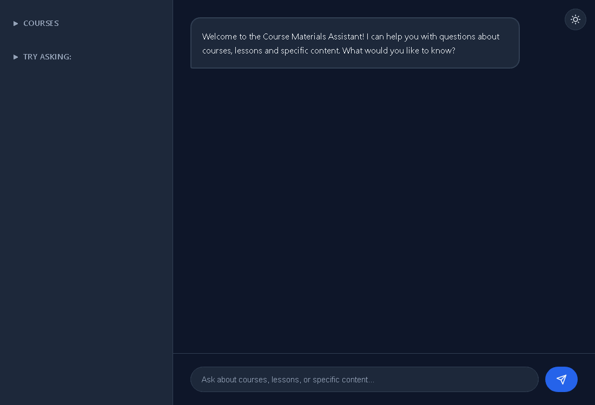

# Course RAG Chatbot

> Assistant conversationnel sur des cours IA DeepLearning.ai — réponses sourcées, évaluation continue, stack d'observabilité complète.

    



---

## Ce que ça fait

Tu poses une question en langage naturel sur des cours IA (Anthropic Claude, MCP, RAG, Agent Skills...). Le système retrouve les passages pertinents dans les transcriptions, génère une réponse sourcée en streaming, et affiche un score de fidélité en temps réel.

```
"Comment fonctionne le tool use dans Claude ?"
→ [REWRITE] query optimisée pour ChromaDB
→ recherche vectorielle (all-MiniLM-L6-v2)
→ Claude Haiku synthétise avec les sources
→ RAGAS faithfulness : 0.93 ✅
```

---

## Fonctionnalités

### RAG Pipeline — 3 niveaux d'amélioration

| Niveau | Feature | Impact |
|--------|---------|--------|
| 1 | **Query rewriting** — Claude Haiku réécrit la question avant la recherche pour maximiser le recall ChromaDB | +recall sémantique |
| 2 | **Auto-tune MAX_RESULTS** — ajuste automatiquement le nombre de chunks selon la moyenne glissante RAGAS (10 dernières requêtes) | fidélité stable |
| 3 | **Multi-round tool calling** — jusqu'à 2 recherches séquentielles par requête pour les comparaisons cross-cours | questions complexes résolues |

### Observabilité complète

- **RAGAS faithfulness** calculé en arrière-plan sur chaque requête, badge coloré inline dans le chat (vert ≥80%, orange ≥60%, rouge <60%)
- **Prometheus** scrape `/metrics` toutes les 15s — distributions de scores, latences
- **Grafana** dashboards préconfigurés (port 3001)
- **Phoenix OTEL** traces de chaque appel LLM Anthropic (port 6007)

### UX

- Streaming SSE — les tokens arrivent au fur et à mesure
- Thumbs up/down sur chaque réponse → feedback persisté en JSON + `/api/feedback/summary`
- Toggle dark/light mode
- Historique de session

---

## Cours indexés (7 cours DeepLearning.ai / Anthropic)

- Building Towards Computer Use with Anthropic
- MCP: Build Rich-Context AI Apps with Anthropic
- Prompt Engineering with Anthropic Claude
- Tool Use with Claude
- Agent Skills with Anthropic
- Claude Code: A Highly Agentic Coding Assistant
- Agent Skills Guide

---

## Stack

```
Frontend    Vanilla JS + SSE streaming
Backend     FastAPI · uvicorn · Python 3.11
LLM         Anthropic Claude Haiku (tool use + query rewriting)
Fallback    Ollama llama3.2:1b (inférence locale)
Vector DB   ChromaDB (persisté sur volume Docker)
Embeddings  all-MiniLM-L6-v2 (sentence-transformers)
Evals       RAGAS faithfulness (LangchainLLMWrapper + ChatAnthropic)
Observ.     Prometheus · Grafana · Arize Phoenix (OTEL)
Deploy      Docker Compose (6 services)
```

---

## Architecture

```
Utilisateur
    │
    ▼
FastAPI /api/query/stream
    │
    ├─ query_rewriter.py    ← Claude Haiku one-shot → query enrichie
    │
    ├─ RAGSystem.query()
    │       ├─ AIGenerator  (tool use, max 2 rounds)
    │       │       └─ CourseSearchTool → ChromaDB
    │       └─ SessionManager (historique)
    │
    ├─ ragas_evaluator      ← async, timeout 60s, auto-tune MAX_RESULTS
    │       └─ Prometheus metrics
    │
    └─ Phoenix OTEL traces
```

---

## Démarrage rapide

### Docker (recommandé)

```bash
cp .env.example .env
# Ajouter ANTHROPIC_API_KEY dans .env

docker compose up --build   # premier lancement (~2 min, pull Ollama)
docker compose up           # lancements suivants
```

| Service | URL |
|---------|-----|
| Chatbot | http://localhost:8000 |
| Grafana | http://localhost:3001 · admin/admin |
| Phoenix | http://localhost:6007 |
| Prometheus | http://localhost:9091 |

### Local (dev)

```bash
uv sync
ollama serve                          # terminal séparé
cd backend && uv run uvicorn app:app --reload --port 8000
```

---

## Ajouter un cours

Déposer un `.txt` dans `docs/` au format suivant et redémarrer — indexation automatique et idempotente :

```
Course Title: <titre>
Course Instructor: <nom>

Lesson 1: <titre>
<contenu>...
```

---

## Tests

```bash
cd backend && uv run pytest tests/ -v
# 5 tests comportementaux sur AIGenerator (multi-round tool calling)
```

---

## Variables d'environnement

| Variable | Défaut | Description |
|----------|--------|-------------|
| `ANTHROPIC_API_KEY` | — | **Requis** |
| `ANTHROPIC_MODEL` | `claude-haiku-4-5-20251001` | Modèle principal |
| `OLLAMA_MODEL` | `llama3.2:1b` | Fallback local |
| `PHOENIX_ENDPOINT` | `http://localhost:6006/v1/traces` | Traces OTEL |

---

## Patterns d'architecture

| Pattern | Où | Pourquoi |
|---|---|---|
| Facade | `RAGSystem` | Interface unique `query()` sur VectorStore + AIGenerator |
| Strategy | `AIGenerator` / `OllamaGenerator` | Swap LLM provider sans changer le code métier |
| Observer | `ragas_evaluator` + Prometheus | Métriques découplées des requêtes |
| Template Method | `RAGSystem.query()` | Séquence fixe : rewrite → retrieve → generate → eval |
