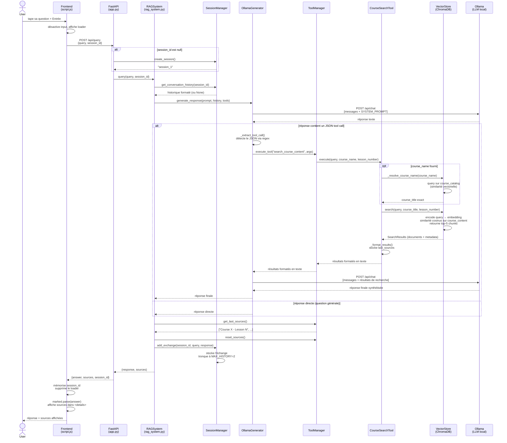

```mermaid
sequenceDiagram
      actor User
      participant FE as Frontend<br/>(script.js)
      participant API as FastAPI<br/>(app.py)
      participant RAG as RAGSystem<br/>(rag_system.py)
      participant SM as SessionManager
      participant OL as OllamaGenerator
      participant TM as ToolManager
      participant CS as CourseSearchTool
      participant VS as VectorStore<br/>(ChromaDB)
      participant Ollama as Ollama<br/>(LLM local)

      User->>FE: tape sa question + Entrée
      FE->>FE: désactive input, affiche loader
      FE->>API: POST /api/query<br/>{query, session_id}

      alt session_id est null
          API->>SM: create_session()
          SM-->>API: "session_1"
      end

      API->>RAG: query(query, session_id)

      RAG->>SM: get_conversation_history(session_id)
      SM-->>RAG: historique formaté (ou None)

      RAG->>OL: generate_response(prompt, history, tools)

      OL->>Ollama: POST /api/chat<br/>[messages + SYSTEM_PROMPT]
      Ollama-->>OL: réponse texte

      alt réponse contient un JSON tool call
          OL->>OL: _extract_tool_call()<br/>détecte le JSON via regex

          OL->>TM: execute_tool("search_course_content", args)
          TM->>CS: execute(query, course_name, lesson_number)

          opt course_name fourni
              CS->>VS: _resolve_course_name(course_name)
              VS->>VS: query sur course_catalog<br/>(similarité vectorielle)
              VS-->>CS: course_title exact
          end

          CS->>VS: search(query, course_title, lesson_number)
          VS->>VS: encode query → embedding<br/>similarité cosinus sur course_content<br/>retourne top-5 chunks
          VS-->>CS: SearchResults (documents + metadata)

          CS->>CS: _format_results()<br/>stocke last_sources
          CS-->>TM: résultats formatés en texte
          TM-->>OL: résultats formatés en texte

          OL->>Ollama: POST /api/chat<br/>[messages + résultats de recherche]
          Ollama-->>OL: réponse finale synthétisée
          OL-->>RAG: réponse finale
      else réponse directe (question générale)
          OL-->>RAG: réponse directe
      end

      RAG->>TM: get_last_sources()
      TM-->>RAG: ["Course X - Lesson N", ...]
      RAG->>TM: reset_sources()

      RAG->>SM: add_exchange(session_id, query, response)
      SM->>SM: stocke l'échange<br/>tronque à MAX_HISTORY=2

      RAG-->>API: (response, sources)
      API-->>FE: {answer, sources, session_id}

      FE->>FE: mémorise session_id<br/>supprime le loader
      FE->>FE: marked.parse(answer)<br/>affiche sources dans <details>
      FE-->>User: réponse + sources affichées
```
